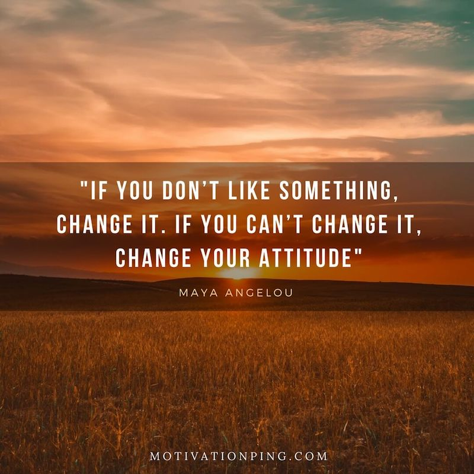

## Table of contents
  * [Title](#Title)
  * [About this project](#about-this-project)
  * [Demo](#demo)
  * [Key Elements](#key-elements)
  * [Technologies used to create app](#technologies-used)
  * [Backend technologies](#Backend)
  * [Frontend technologies](#Frontend)

##  Project XX

##  About this project

 Team Members

<ul>
  <li> John Smith (@john) </li>
  <li>Jane Doe (@jane) </li>
 <li>CC Stinson (@cc) </li>
</ul>

 Project Name

### Project Description:
FYL is an interactive tool that allows the user to enhance their quality of life by actively tracking their annual goals. The application will utilize an API titled ‘Goals’ to incentivize user participation to input what they feel they can accomplish. The user signs in and next enters their goals.  The tool will timestamp the goals and track it for the user in the database.  The user can delete the goal or change the goals if needed. This is a simple full stack development tool that is easy to use for an active user to track their progress throughout the week, month, and year. 

##  Demo

[Insert Youtube Video]

##  Key Elements and Features

Visual

Make High Level Goals

Priority Setting

Make Specific Plans with timescales

Motivation 

Tracking

Change, update, or delete goal
 

Motivation

How to efficiently track yearly goals on a weekly, monthly, and annual basis to increase accomplishments thus improving quality of life.  This was inserted by our team’s cohort year 2019 resolution and displays of Passion  Planners #PASHFAM

 
##  Technologies used to build app

<ul>
<li>[Backend technologies](#Backend)
<li>[Frontend technologies](#Frontend)
<li>[New technologies](#New)
<ul/>
	
##  Backend technologies
<ul>
<li>Node.js (https://nodejs.org/en/)
<li>Express (https://expressjs.com/)
<li>MySQL (https://www.mysql.com/)
</ul>

##  Frontend technologies
<ul>
<li>HTML
<li>CSS
<li>Javascript
<li>Handlebars (https://handlebarsjs.com/)
</ul>

##  New technologies
<ul>
Materialize (https://materializecss.com/)
</ul>

## API Reference: 
<ul>
Created Goals as a way for users to track
</ul>

## Future State: 
<ul>
<li>Authentication 
<li>Reminder Prompts 
<li>Journal Entry
<li>Weekly Motivational Quotes
<li>Timers
</ul>
Motivational Quotes 

## Copyright: 
CC Stinson (@cc)

© 2019 All Rights Reserved
